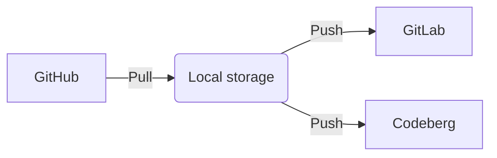

# Welcome to Autosync git repos!

Hi! Autosync git repos is a python script which helps you maintain backup of your GitHub repositories in GitLab and Codeberg. With a combination of the script and cronjob to execute it, make sure you never lose your precious code!



# Setup

**Very Important** - If you have cloned the Autosync git repo, then delete the **.git** folder in its base directory using `sudo rm -r .git`

## 1. Configure config.ini

Create config.ini file in the base directory and fill the following values.

```
[DEFAULT]

GIT_USERNAME = <git-username>
GIT_ORG_NAME = <organization-group-name>
GITLAB_GROUP_ID = <gitlab-group-id>
GITLAB_API_TOKEN = <gitlab-personal-access-token>
CODEBERG_API_TOKEN = <codeberg-personal-access-token>
GITHUB_API_TOKEN = <github-personal-access-token>
```

You will need to create personal access tokens under your account's 'Settings' tab at https://github.com , https://gitlab.com , https://codeberg.org

## 2. Configure continuous synchronization

### Supervisord

Setup supervisord configuration file for the script

`sudo vim /etc/supervisor/conf.d/autosync-repos.conf`

with the following content

```
[program:sync-git-repos]

directory=<path to base directory>
command=/usr/bin/python3 <path to base directory>/sync_repos.py
user=<user>
autostart=false
autorestart=false
stopasgroup=true
killasgroup=true
stderr_logfile=/var/log/sync-git-repos/sync-git-repos.err.log
stdout_logfile=/var/log/sync-git-repos/sync-git-repos.out.log

```

Initialize supervisor settings with

```
sudo mkdir /var/log/sync-git-repos/
sudo touch /var/log/sync-git-repos/sync-git-repos.err.log
sudo touch /var/log/sync-git-repos/sync-git-repos.out.log

sudo supervisorctl reread
sudo supervisorctl update
```

Start the script `sudo supervisorctl start sync-git-repos`
Check script status `sudo supervisorctl status sync-git-repos`

### Cronjob

Setup a cronjob to execute the Python script *sync-repos.py*

```
sudo crontab -e

# Sync every hour of the day
0 * * * * supervisorctl start sync-git-repos
```
